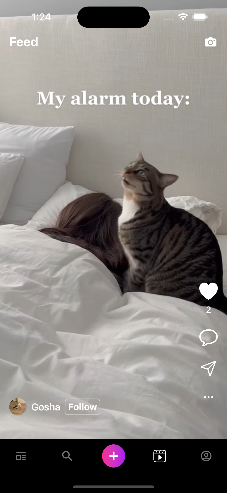

# Zingo

A social app for publishing posts and videos.

### A social app with many features:

- Registration by phone number
- Create user profile
- Update user profile
- Follow and followers
- Create a post with images
- Post likes and comments
- Messenger
- Creating a image story
- Video feed
- Recording or adding short videos (15/30 seconds)
- Video upload
- Download videos
- Like and comment on videos

### Stack and technology:

iOS 16+, Swift, SwiftUI, Combine, Firebase, NukeUI, async/await

## 📹 Video 

## 📷 Screenshots 

## Screenshots 📷

 

   
   
   
   
   
   
   
   
   
   
   
   

   

   ## Author
* [Bogdan Zykov](https://github.com/BogdanZyk)

## License

 Copyright 2022 Bogdan Zykov.
 [License MIT](https://opensource.org/licenses/MIT)
